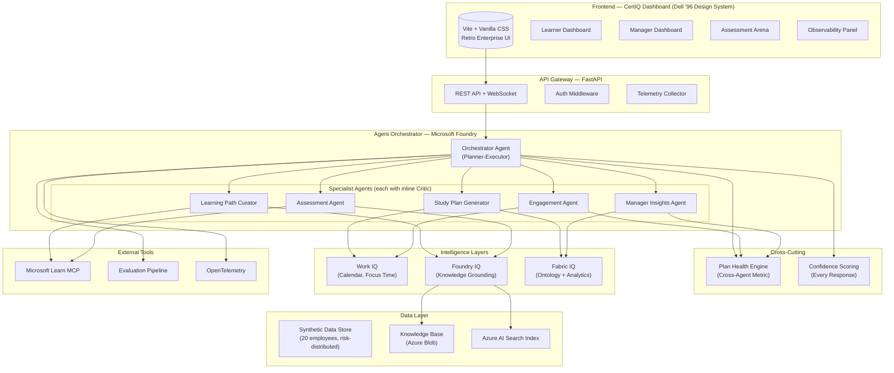
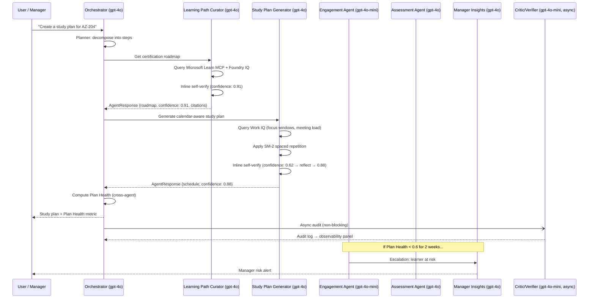

<div align="center">


# CertIQ
### Enterprise Certification Intelligence Platform

*Multi-agent AI system for organisational certification programme management*

---

[](https://azure.microsoft.com/products/ai-foundry/)
[](https://learn.microsoft.com/api/mcp)
[](https://azure.microsoft.com/products/ai-foundry/)
[](https://python.org)
[](https://fastapi.tiangolo.com)
[](https://vitejs.dev)

[](LICENSE)
[]()
[]()
[]()

</div>

---

## Overview

**CertIQ** is a production-grade, multi-agent enterprise learning system that transforms how organisations manage internal certification programmes. Built on **Microsoft Azure AI Foundry**, it orchestrates seven specialised reasoning agents to deliver adaptive study plans, grounded assessments, and real-time team readiness insights — all grounded in all three Microsoft IQ intelligence layers.

> Built for the **Microsoft Reasoning Agent Track** — designed to be production-ready, not just demo-ready.

### The Problem

Enterprise certification programmes fail because:
- Study plans ignore real work schedules and meeting load
- Practice questions are generic, not grounded in organisational knowledge
- Managers have no visibility into team readiness until it's too late
- No system adapts when an employee falls behind

### The Solution

CertIQ deploys seven specialised agents that collaborate continuously:

```
Employee Request → Orchestrator → [Learning Path Curator] → [Study Plan Generator]
                                → [Engagement Agent] ←── Work IQ (calendar signals)
                                → [Assessment Agent] ←── Foundry IQ (grounded questions)
                                → [Manager Insights] ←── Fabric IQ (ontology analytics)
                                → [Critic/Verifier]  (async quality audit)
```

Every agent returns a **confidence score**. When confidence drops below threshold, the system triggers visible self-reflection — rebuilding the response with augmented context. Judges, managers, and learners can all see this happen in real time.

---

## Architecture



---

## Agents

| Agent | Model | Responsibility | Tools |
|---|---|---|---|
| **Orchestrator** | `gpt-4o` | Planner-Executor: decomposes requests, routes to specialists, triggers self-reflection | All agents via ConnectedAgentTool |
| **Learning Path Curator** | `gpt-4o` | Maps learner goals → certification roadmap → prerequisite graph | Microsoft Learn MCP, Foundry IQ |
| **Study Plan Generator** | `gpt-4o` | Converts roadmap into calendar-aware weekly schedule with spaced repetition | Work IQ, Fabric IQ |
| **Engagement Agent** | `gpt-4o-mini` | Monitors Plan Health, adapts reminders to work patterns, escalates risks | Work IQ, Plan Health Engine |
| **Assessment Agent** | `gpt-4o` | Generates grounded, cited questions calibrated to Bloom's Taxonomy level | Foundry IQ, Microsoft Learn MCP |
| **Manager Insights Agent** | `gpt-4o` | Team readiness analytics, risk alerts, natural language queries over team data | Fabric IQ, Plan Health Engine |
| **Critic / Verifier** | `gpt-4o-mini` | Async post-hoc audit — bias detection, hallucination check, RAI compliance | All agent outputs |

> **Inline Critic pattern**: Each agent also self-verifies via embedded system prompt logic before returning — no extra network hop. The standalone Critic runs asynchronously for the observability audit trail only.

---

## Key Features

### 📊 Plan Health — Cross-Agent Metric
```
Plan Health = completed_study_hours / (recommended_hours × availability_factor)
```
No single agent computes this. It draws from the Study Plan Generator (recommended hours), Engagement Agent (actual hours tracked), and Work IQ (availability factor from calendar). If Plan Health drops below 0.6 for two consecutive weeks, the Engagement Agent automatically escalates to the Manager Insights Agent. Surfaced as a real-time metric card in both dashboards.

### 🎯 Confidence Scores with Visible Self-Reflection
Every agent response carries a `confidence_score` (0.0–1.0), displayed in the UI. When confidence falls below the threshold (0.65), the Orchestrator triggers a reflection retry with augmented context. The UI shows the before/after: *"confidence was 0.62 → triggered reflection → revised to 0.89."*

### 📚 Bloom's Taxonomy Adaptive Assessment
Questions are calibrated to the learner's cognitive stage — not just difficulty. Early-stage learners see **Remember** and **Understand** questions (definitions, comparisons). Advanced learners see **Apply** and **Analyze** questions (architecture trade-offs, failure scenario diagnosis). Powered by a custom `bloom_taxonomy.py` engine.

### 🔄 Spaced Repetition (SM-2 Algorithm)
The Study Plan Generator uses the SuperMemo SM-2 algorithm to schedule review sessions at scientifically optimal intervals. Review frequency adapts based on quiz scores and time elapsed since last study.

### 🛡️ Human-in-the-Loop Approval Gate
When the Assessment Agent determines a learner is ready for their certification exam, the readiness status is held in a **pending approval** queue in the Manager Dashboard. The manager reviews the readiness score, confidence badge, and study hours completed — then approves or defers. No exam readiness is confirmed without a human decision.

### 🎨 Dell '96 Retro Design System
The dashboard is built on an interpreted Dell 1996 catalog-era design language: literal black page frames, flat ribbon-card tints (sage, salmon, periwinkle, lime, sky, peach, olive, steel), chunky Arial Black headlines, Times Roman body copy, and GIF-style sticker overlays ("AT RISK" bursts, "ON TRACK" badges, circular cert seals). Deliberately memorable in a sea of generic dark-mode dashboards.

---

## Reasoning Patterns

| Pattern | Implementation |
|---|---|
| **Planner-Executor** | Orchestrator decomposes every request into a typed execution plan before routing to specialists |
| **Inline Critic-Verifier** | Each agent's system prompt includes a structured verification checklist it must complete before returning |
| **Self-Reflection & Iteration** | Orchestrator monitors `confidence_score`; retries with augmented context when below threshold |
| **Role-Based Specialisation** | 7 agents with non-overlapping responsibilities — each owns exactly one domain |

---

## Microsoft IQ Integration

### Work IQ
Personalises study scheduling around real work context. The `integrations/work_iq.py` module provides `get_focus_windows()`, `get_meeting_density()`, and `compute_availability_factor()` — the last of which feeds directly into the Plan Health formula. Designed against the real Work IQ MCP API contract for production upgrade.

### Foundry IQ
Grounds all assessment questions and knowledge retrieval in indexed organisational documents. Built on Azure AI Search with the `azure-ai-projects` SDK. Every answer returned by the Assessment Agent includes a `Citation` object with source document, section, and relevance score.

### Fabric IQ
The **Certification Intelligence Ontology** — a semantic graph model covering:
```
Employee ──has──► Role ──requires──► Certification
     │                                    │
     └──has──► Skills ──maps_to──► SkillsRequired
     │
     └──has──► PlanHealth ──monitored_by──► EngagementAgent
```
Powers the Manager Insights Agent's team readiness analytics, skill gap analysis, and pass probability predictions.

---

## Tech Stack

| Layer | Technology |
|---|---|
| **Agent Framework** | Microsoft Agent Framework (`agent-framework`), Azure AI Projects SDK (`azure-ai-projects>=2.0.0`) |
| **Primary Models** | `gpt-4o` (Orchestrator, Curator, Study Plan, Assessment, Manager) |
| **Lite Models** | `gpt-4o-mini` (Engagement Agent, async Critic) |
| **Knowledge Grounding** | Azure AI Search + Foundry IQ agentic retrieval |
| **External MCP** | Microsoft Learn MCP (`https://learn.microsoft.com/api/mcp`) |
| **Backend** | FastAPI + Uvicorn, WebSocket for real-time traces |
| **Frontend** | Vite + Vanilla JS + Vanilla CSS (Dell '96 design system) |
| **Observability** | OpenTelemetry + Azure Monitor |
| **Evaluation** | `azure-ai-evaluation` SDK (Groundedness, Relevance, Fairness, PlanFeasibility) |
| **Deployment** | Docker → Azure App Service (backend) + Azure Static Web Apps (frontend) |

---

## Project Structure

```
certiq/
├── agents/                     # All 7 specialised agents
│   ├── schemas.py              # Universal AgentResponse schema (confidence_score, verification, citations)
│   ├── config.py               # Tiered model config (gpt-4o / gpt-4o-mini)
│   ├── orchestrator.py         # Planner-Executor + self-reflection
│   ├── learning_path_curator.py
│   ├── study_plan_generator.py
│   ├── engagement_agent.py
│   ├── assessment_agent.py
│   ├── manager_insights_agent.py
│   └── critic_verifier.py      # Async audit — never blocks critical path
│
├── integrations/               # Microsoft IQ layer connectors
│   ├── work_iq.py              # Calendar signals + availability factor
│   ├── foundry_iq.py           # Agentic retrieval + citations
│   ├── fabric_iq.py            # Certification Intelligence Ontology
│   └── microsoft_learn_mcp.py  # learn.microsoft.com/api/mcp client
│
├── reasoning/                  # Reasoning engines
│   ├── planner.py              # Planner-Executor pattern
│   ├── reflection.py           # Confidence scoring + self-reflection
│   ├── plan_health.py          # Cross-agent Plan Health metric
│   ├── spaced_repetition.py    # SM-2 algorithm
│   └── bloom_taxonomy.py       # Cognitive level calibration
│
├── api/                        # FastAPI backend
│   ├── main.py
│   └── routes/
│       ├── learner.py          # Onboarding, learning path, study plan, chat, progress
│       ├── assessment.py       # Start session, answer, results
│       ├── manager.py          # Team overview, risk report, HITL approval gate
│       └── telemetry.py        # Traces, evaluations, metrics
│
├── observability/              # Production-grade observability
│   ├── telemetry.py            # OpenTelemetry tracing
│   ├── evaluation.py           # azure-ai-evaluation pipeline
│   └── responsible_ai.py       # Content safety, bias detection, PII redaction
│
├── data/synthetic/             # All synthetic — no real employee data
│   ├── employees.json          # 20 profiles: 3 at-risk, 4 struggling, 8 on-track, 3 excelling, 2 new
│   ├── certifications.json     # AZ-204 (primary) + 9 others with full prerequisite graph
│   ├── calendar_data.json      # Simulated Work IQ signals (2-week rolling window)
│   ├── study_history.json      # Historical sessions, scores, retention rates
│   └── org_knowledge/          # Synthetic knowledge base documents
│       ├── az204_study_guide.md   ← Primary demo cert content
│       ├── az900_study_guide.md
│       ├── cloud_best_practices.md
│       └── exam_preparation_tips.md
│
├── scripts/
│   ├── setup_knowledge_base.py # Index org_knowledge into Azure AI Search
│   ├── run_evaluations.py      # Run evaluation pipeline + record scores
│   └── demo_scenario.py        # --mock (pre-computed) or --live (Azure calls)
│
├── evaluation/
│   ├── test_cases.jsonl
│   ├── golden_answers.jsonl
│   └── evaluation_config.yaml
│
├── frontend/                   # Dell '96 retro enterprise dashboard
│   ├── src/styles/tokens.css   # Full design system token map
│   └── src/pages/
│       ├── Onboarding.js
│       ├── LearnerDashboard.js
│       ├── ManagerDashboard.js  # Includes HITL approval queue
│       ├── Assessment.js
│       └── Observability.js
│
├── Dockerfile                  # Multi-stage: Python + Node
│   └── ... (configuration details)
├── docker-compose.yml
├── requirements.txt
├── pyproject.toml
└── .env.example                # All required variables — never commit .env
```

---

## Getting Started

### Prerequisites

- Python 3.11+
- Node.js 20+
- An Azure subscription (student account with free credits works)
- Azure AI Foundry project in **East US 2** with `gpt-4o` and `gpt-4o-mini` deployed
- Azure AI Search service (Free tier)
- Azure Blob Storage account

### 1. Clone the repository

```bash
git clone https://github.com/yourusername/CertIQ.git
cd CertIQ
```

*Note: Be sure to replace `yourusername` with your actual GitHub username.*

### 2. Configure environment variables

```bash
cp .env.example .env
# Fill in your values — never commit this file
```

Required variables:

```env
FOUNDRY_PROJECT_ENDPOINT=https://your-project.services.ai.azure.com
FOUNDRY_MODEL_PRIMARY=gpt-4o
FOUNDRY_MODEL_LITE=gpt-4o-mini
AZURE_SEARCH_ENDPOINT=https://your-search.search.windows.net
AZURE_SEARCH_KEY=your-admin-key
AZURE_BLOB_CONNECTION_STRING=DefaultEndpointsProtocol=https;...
```

### 3. Install Python dependencies

```bash
pip install -r requirements.txt
```

### 4. Set up the knowledge base

```bash
python scripts/setup_knowledge_base.py
```

This uploads the synthetic org knowledge documents to Azure Blob Storage and indexes them into Azure AI Search for Foundry IQ grounded retrieval.

### 5. Run the backend

```bash
uvicorn api.main:app --reload --port 8000
```

### 6. Run the frontend

```bash
cd frontend
npm install
npm run dev
```

The dashboard will be available at `http://localhost:5173`.

### 7. Run the demo scenario

```bash
# Safe mode — uses pre-computed responses (no Azure calls required)
python scripts/demo_scenario.py --mock

# Live mode — real Azure AI Foundry calls
python scripts/demo_scenario.py --live
```

---

## Deployment

The full system deploys to Azure with a single Docker build.

```bash
# Build the container
docker build -t certiq .

# Deploy to Azure App Service
az webapp up --name certiq-app --resource-group certiq-rg --runtime "PYTHON:3.13"
```

Frontend deploys to **Azure Static Web Apps**:

```bash
az staticwebapp create --name certiq-frontend --resource-group certiq-rg \
  --source frontend --location eastus2
```

---

## Evaluation

CertIQ includes a full evaluation pipeline using the `azure-ai-evaluation` SDK with four custom evaluators:

| Evaluator | What it measures |
|---|---|
| **GroundednessEvaluator** | Are assessment questions grounded in source documents, not hallucinated? |
| **RelevanceEvaluator** | Are generated learning paths relevant to the learner's stated role and goals? |
| **FairnessEvaluator** | Are questions free from demographic bias across the synthetic employee profiles? |
| **PlanFeasibilityEvaluator** | Are study plans realistic given each employee's calendar and historical velocity? |

```bash
python scripts/run_evaluations.py
# Outputs: evaluation_results.json with scores per evaluator
```

---

## Responsible AI

CertIQ applies Responsible AI principles throughout:

| Control | Implementation |
|---|---|
| **Transparency** | Every AI-generated output displays a `confidence_score` badge (0.0–1.0) |
| **Human oversight** | Manager HITL approval gate before any exam readiness is finalised |
| **Content safety** | Input/output filters on all agent interactions |
| **Bias detection** | Question difficulty distribution monitored across synthetic profiles |
| **PII protection** | Synthetic data only; PII detection patterns in `responsible_ai.py` demonstrate production posture |
| **Grounding** | All assessment questions cite their source document and section |
| **Self-reflection** | Agents revise low-confidence outputs before presenting to users |

---

## Synthetic Data Notice

> **All data in this repository is entirely synthetic.** No real employee records, no real customer data, no PII of any kind. The 20 employee profiles are procedurally generated with deliberate risk-distribution contrast for demonstration purposes. Certification data reflects publicly available Microsoft certification information only.

---

## Agent Interaction Flow



---

## Observability

The Observability Panel exposes:
- **Reasoning traces** — every agent invocation, tool call, and reasoning step as a timeline of ribbon cards
- **Confidence score history** — before/after for each self-reflection event
- **Plan Health breakdown** — which data sources contributed what values
- **Async Critic audit log** — post-hoc quality assessment results
- **Evaluation pipeline scores** — Groundedness, Relevance, Fairness, PlanFeasibility

---

## Contributing

This is a hackathon submission. Issues and discussions are welcome — please open a GitHub Issue for any feedback.

---

## License

MIT License — see [LICENSE](LICENSE) for details.

---

<div align="center">

**Built with Microsoft Azure AI Foundry · Microsoft Agent Framework · Microsoft Learn MCP**

*Work IQ · Foundry IQ · Fabric IQ*

</div>
